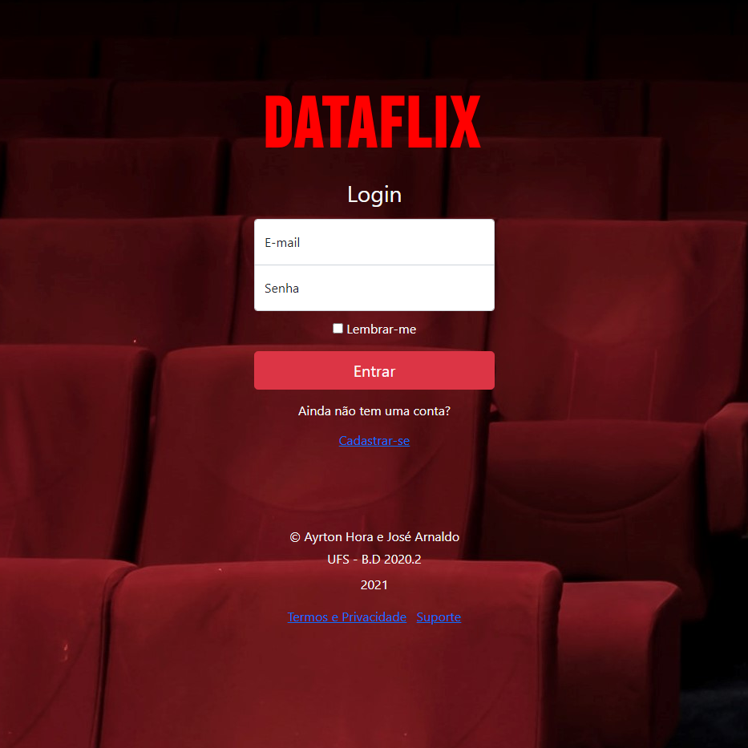
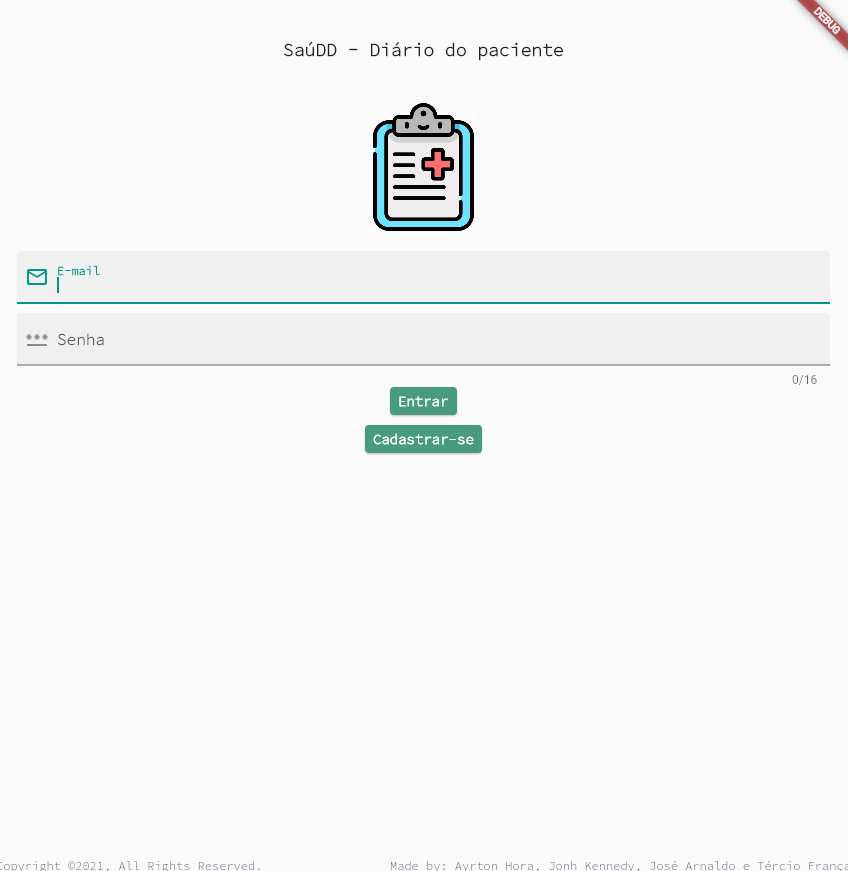
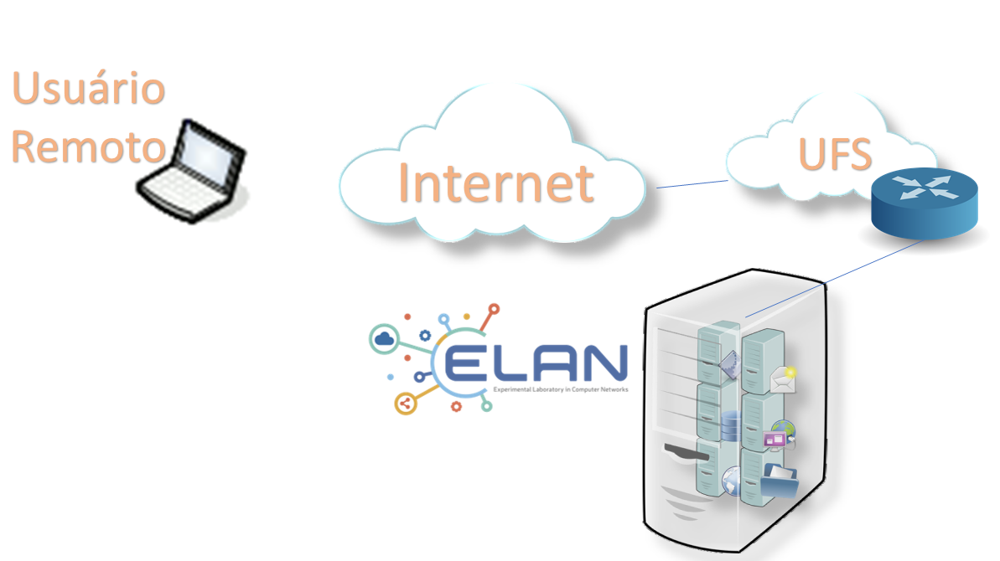
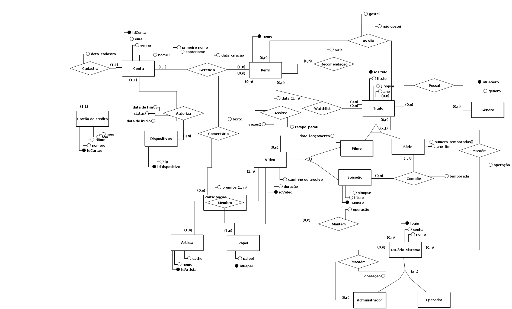
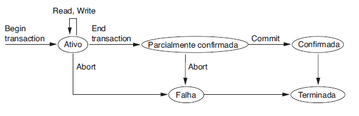
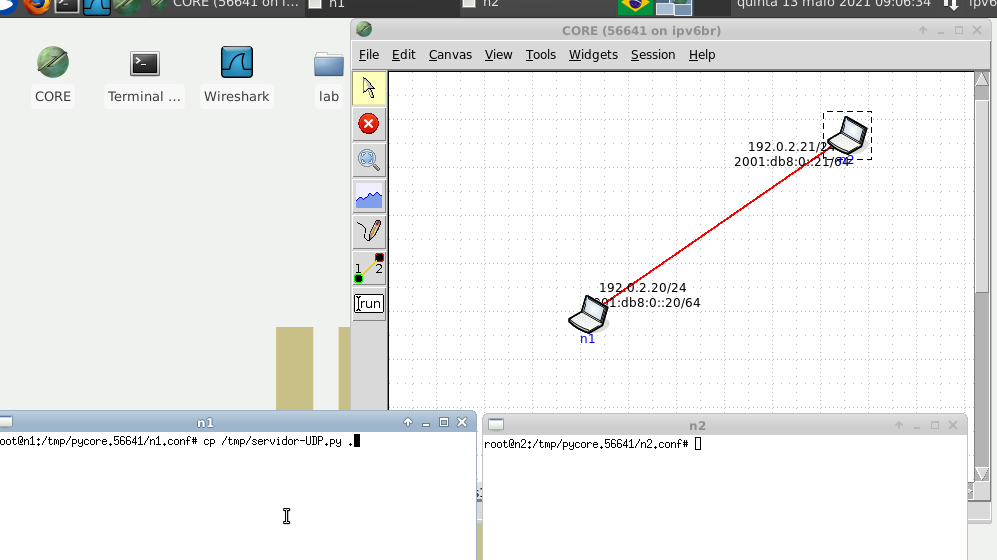
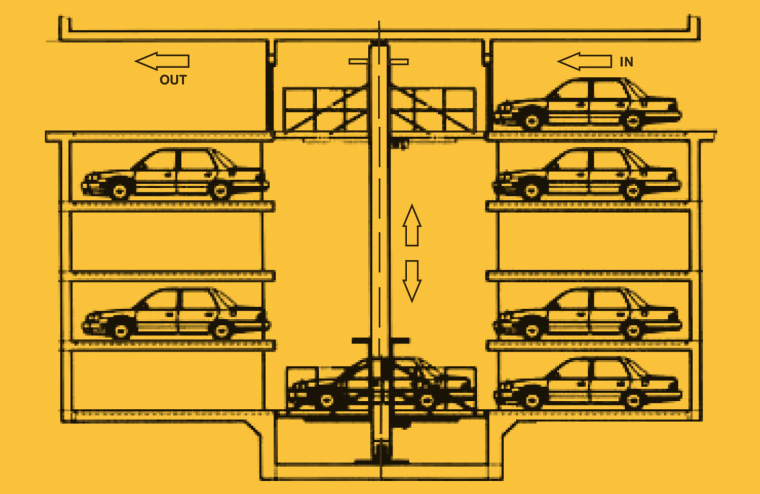
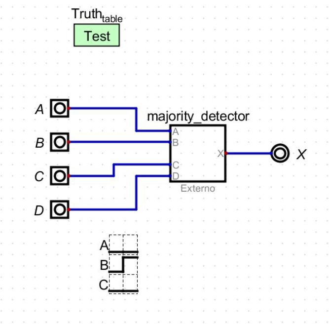

#### **Language:** [Portuguese - Brazil](index.md) / [English](index_en_US.md)  
# Ayrton Hora # 

Este é meu portfólio em desenvolvimento. Tenho está págino como local de registro de meus projetos e atividades, onde contextuo e documento sobre os mesmos ao longo do tempo.

Uma visão geral sobre mim e os repositórios pode ser encontrada em meu [perfil do GitHub](https://github.com/ayrton-hora).

De maneira metodológica, os projetos ou atividades citadas aqui, serão organizados individualmente pelos seguintes tópicos: 

- ***Título***
- ***Motivação/Problema*** 
- ***Descrição*** 
- ***Dificuldades*** 
- ***Aprendizado*** 
- ***Resultados***

# Projetos


## **DataFlix**
_Projeto final prático da disciplina de Banco de Dados I, uma mini aplicação web de streaming._



[Veja mais...](assets/pages/dataflix.md)


## **SaúDD - Diário do Paciente**
_Projeto prático da disciplina e Engenharia de Software II, uma aplicação mobile para Android._



[Veja mais...](assets/pages/saudd.md)


## **Aplicação em container para envio de arquivos - Docker**
_Projeto prático da disciplina de Laboratório de Redes de Computadores, uma aplicação de rede compactada em container._



[Em progresso...]()


## **DEER - Mapeamento para aplicação**
_Mapeamento de um diagrama de entidade relacionamento estendido para criação de um projeto lógico de banco de dados, utiliza MySQL Workbench._



[Em progresso...]()


## **Aplicações de banco de dados e Transações - Java**
_Atividade introdutória à aplicações e transações em banco de dados utilizando API's, uso da JDBC._



[Em progresso...]()


## **Busca de arquivos em árvore de diretórios - Python e MPI**  
_Implementação sequencial e paralela para localizar arquivos em uma árvore de diretórios, utiliza Python e MPI._

 

[Em progresso...]()


## **Produtor e consumidor, histograma de casos de COVID-19 em SP - Java**
_Implementação sequencial e paralela de um histograma baseado em idades, com registro dos casos de COVID-19 do estado de São Paulo._


[Em progresso...]()


## **WebQuest - Socket's com Python**
_Implementação simulada em máquina Linux de sockets entre duas máquinas, ocorrendo comunicação pela rede._



[Em progresso...]()


## **Sistema de estacionamento de carros - Linguagem C** 
_Projeto prático final da disciplina de Estrutura de Dados, implementação de um mini sistema de estacionamento de veículos, vagas dinâmicas, sistema de tempo e expansão._



[Em progresso...]()


## **Problemas clássicos de comunicação entre processos - Java**
_Abordagem e resolução de alguns dos problemas clássicos de comunicação entre processos, discutido na disciplina de Sistemas Operacionais._


[Em progresso...]()


## **Detector de Maioria - VHDL**
_Projeto prático final da disciplina de Fundamentos de Sistemas Digitais, com um processo lógico, descritivo, e testado em simulações._




[Em progresso...]()

<!-- ## **Módulos de sistema de informação PROCC (DCOMP - UFS) - Python**

```
Em progresso...
``` -->