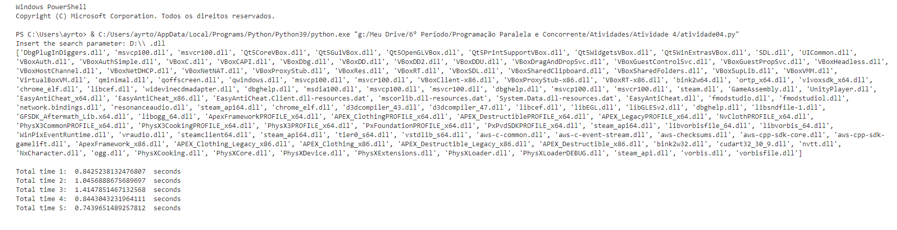

#### **Language:** [Portuguese - Brazil](index.md) / [English](index_en_US.md)  
# Ayrton Hora # 

Este é meu portfólio em desenvolvimento. Tenho está págino como local de registro de meus projetos e atividades, onde contextuo e documento sobre os mesmos ao longo do tempo.

Uma visão geral sobre mim e os repositórios pode ser encontrada em meu [perfil do GitHub](https://github.com/ayrton-hora).

De maneira metodológica, os projetos ou atividades citadas aqui, serão organizados individualmente pelos seguintes tópicos: 

- ***Título***
- ***Motivação/Problema*** 
- ***Descrição*** 
- ***Dificuldades*** 
- ***Aprendizado*** 
- ***Resultados***

# Projetos


## **DataFlix**
_Projeto final prático da disciplina de Banco de Dados I, uma mini aplicação web de streaming._


[Veja mais...](assets/pages/dataflix.md)


## **SaúDD - Diário do Paciente**
_Projeto prático da disciplina e Engenharia de Software II, uma aplicação mobile para Android._


[Veja mais...](assets/pages/saudd.md)

## **DEER - Mapeamento para aplicação**


[Em progresso...]()

## **Aplicações de banco de dados e Transações - Java**


[Em progresso...]()

## **Aplicação em container para envio de arquivos - Docker**


[Em progresso...]()

## **WebQuest - Socket's com Python**


[Em progresso...]()

## **Produtor e consumidor, Histograma dos casos de COVID-19 SP - Java**


[Em progresso...]()

## **Busca de arquivos em árvore de diretórios - Python e MPI**



[Em progresso...]()

## **Sistema de estacionamento de carros - C** 


[Em progresso...]()

## **Problemas clássicos de comunicação entre processos - Java**


[Em progresso...]()

## **Detector de Maioria - VHDL**


[Em progresso...]()

<!-- ## **Módulos de sistema de informação PROCC (DCOMP - UFS) - Python**

```
Em progresso... -->
```