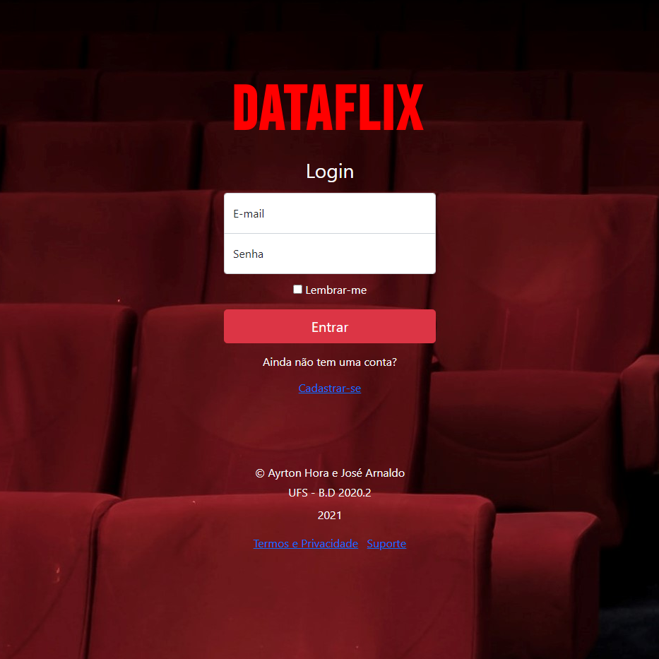
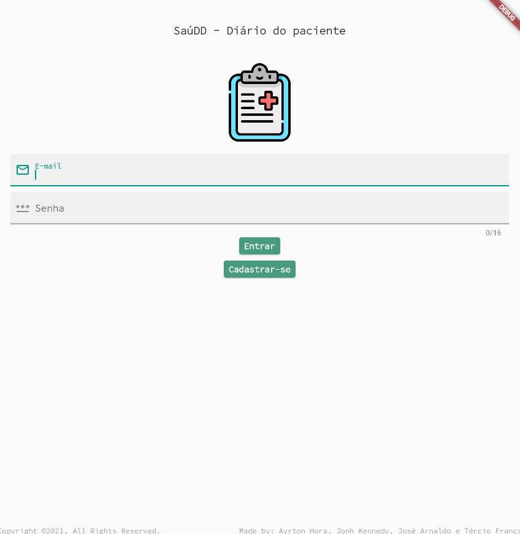

#### **Language:** [Portuguese - Brazil](index.md) / [English](index_en.md)  
# Ayrton Hora # 

This is my developing portfolio. I have this page as a place to register my projects and activities, where I context and document them over time.

An overview about me and the repositories can be found in my [GitHub profile](https://github.com/ayrton-hora).

Methodologically, the projects or activities mentioned here will be individually organized by the following topics:

- ***Tittle***
- ***Motivation/Problem*** 
- ***Description*** 
- ***Difficulties*** 
- ***Knowledge*** 
- ***Results***

# Projects


## **DataFlix**
_Practical final project of the Database I discipline, a mini streaming web application._



[More...](assets/pages/dataflix.md)


## **SaúDD - Patient diary**
_Practical project of the discipline and Software Engineering II, a mobile application for Android._



[More...](assets/pages/saudd.md)

## **EER - Mapping for application**

```
Work in progress...
```

## **Transactions and Database applications - Java**

```
Work in progress...
```

## **Container aplication for sending files - Docker**

```
Work in progress...
```

## **WebQuest - Socket's with Python**

```
Work in progress...
```

## **Producer and consumer, Histogram COVID-19 cases on SP - Java**

```
Work in progress...
```

## **Directory tree file search - Python e MPI**

```
Work in progress...
```

## **Car parking system - C** 

```
Work in progress...
```

## **Classic interprocess communication problems - Java**

```
Work in progress...
```

## **Majority detector - VHDL**

```
Work in progress...
```

## **Modules for an information system PROCC (DCOMP - UFS) - Python**

```
Work in progress...
```