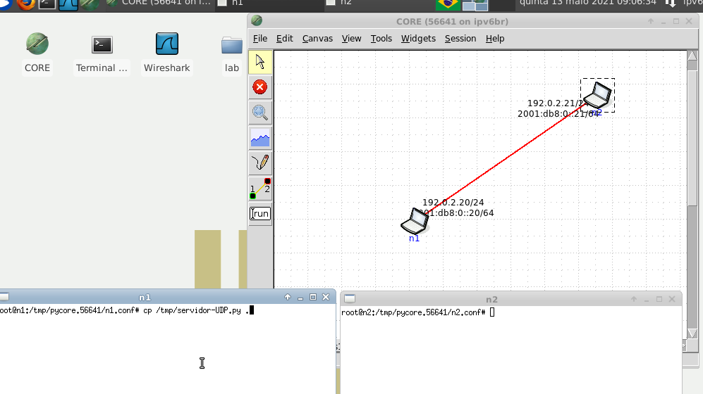

#### **Language:** [Portuguese - Brazil](index.md) / [English](index_en_US.md)  
# Ayrton Hora # 

This is my developing portfolio. I have this page as a place to register my projects and activities, where I context and document them over time.

An overview about me and the repositories can be found in my [GitHub profile](https://github.com/ayrton-hora).

Methodologically, the projects or activities mentioned here will be individually organized by the following topics:

- ***Tittle***
- ***Motivation/Problem*** 
- ***Description*** 
- ***Difficulties*** 
- ***Knowledge*** 
- ***Results***

# Projects

## **DataFlix**
_Practical final project of the Database I discipline, a mini streaming web application._

[More...](assets/pages/dataflix.md)

## **SaúDD - Patient diary**
_Practical project of the discipline and Software Engineering II, a mobile application for Android._

[More...](assets/pages/saudd.md)

## **Container aplication for sending files - Docker**
_Practical project of the Computer Networks Laboratory course, a package compressed network application in container._

[Work in progress...]()

## **EER - Mapping for application**
_Mapping an extended entity relationship diagram to create a logical database project, using MySQL Workbench._

[Work in progress...]()

## **Transactions and Database applications - Java**
_Introductory activity to database applications and transactions using API's, with JDBC._

[Work in progress...]()

## **Directory tree file search - Python e MPI**
_Sequential and parallel implementation to find files in a directory tree, uses Python and MPI._

 

[Work in progress...]()

## **Producer and consumer, Histogram COVID-19 cases on SP - Java**
_Sequential and parallel implementation of an age-based histogram, recording COVID-19 cases in the state of São Paulo._

[Work in progress...]()

## **WebQuest - Socket's with Python**
_Simulated implementation on a Linux machine of sockets between two machines, communicating over the network._

[Work in progress...]()

## **Car parking system - C language** 
_Final practical project of the Data Structure discipline, implementation of a mini vehicle parking system, dynamic spaces, time system and expansion._

[Work in progress...]()

## **Classic interprocess communication problems - Java**
_Approach and resolution of some of the classic problems of communication between processes, discussed in the Operating Systems discipline._

[Work in progress...]()

## **Majority detector - VHDL**
_Final practical project of the discipline of Digital Systems Fundamentals, with a logical, descriptive process, and tested in simulations._

[Work in progress...]()

<!-- ## **Modules for an information system PROCC (DCOMP - UFS) - Python**

[Work in progress...]() -->